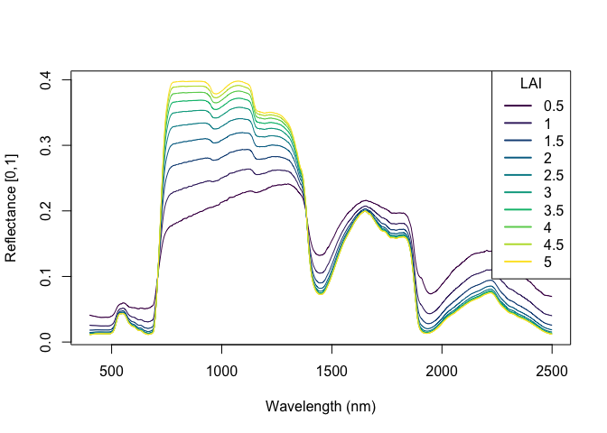
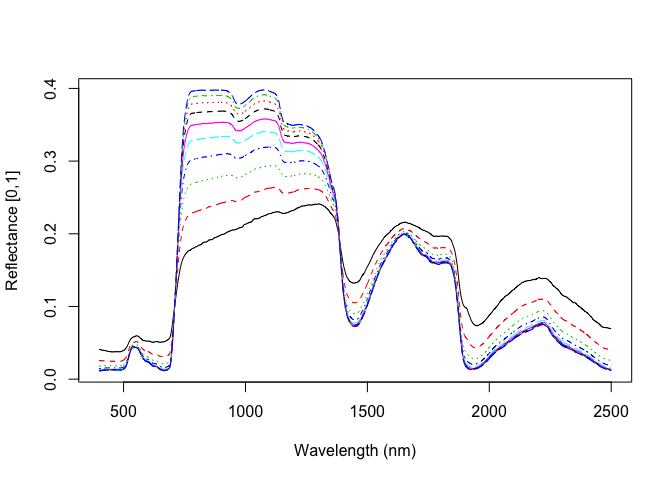

# Creating ENVI files for Hypertrace

Hypertrace is only set up to work with ENVI binary files. These files
can be easily created using GDAL utilities. This wiki page shows some
examples for creating ENVI files in R and Python.

## R

We’ll start by generating an example set of spectra from simulations
using the PRO4SAIL canopy radiative transfer model, as implemented in
the [`rrtm` package](https://github.com/ashiklom/rrtm). However, any
similarly-formatted set of spectral data will work.

``` r
# install.packages("remotes")
# remotes::install_github("ashiklom/rrtm")
library(rrtm)
laiseq <- seq(0.5, 5, 0.5)
rawspec <- lapply(laiseq, pro4sail_5, N = 1.4, Cab = 40, Car = 8,
                  Cbrown = 0, Cw = 0.01, Cm = 0.01, soil_moisture = 0.8)
refl <- lapply(rawspec, "[[", "hdr")
wavelengths <- seq(400, 2500)
spec_matrix <- do.call(cbind, refl)
dim(spec_matrix)
```

    ## [1] 2101   10

``` r
head(spec_matrix)
```

    ##            [,1]       [,2]       [,3]       [,4]       [,5]       [,6]
    ## [1,] 0.04099503 0.02555602 0.01816261 0.01462399 0.01293092 0.01212105
    ## [2,] 0.04091109 0.02552017 0.01814983 0.01462227 0.01293450 0.01212718
    ## [3,] 0.04082125 0.02547949 0.01813277 0.01461653 0.01293420 0.01212948
    ## [4,] 0.04073946 0.02544675 0.01812353 0.01461855 0.01294159 0.01213945
    ## [5,] 0.04065062 0.02541681 0.01812172 0.01463017 0.01295963 0.01216054
    ## [6,] 0.04057584 0.02539414 0.01812391 0.01464419 0.01297929 0.01218289
    ##            [,7]       [,8]       [,9]      [,10]
    ## [1,] 0.01173373 0.01154852 0.01145996 0.01141762
    ## [2,] 0.01174107 0.01155644 0.01146816 0.01142595
    ## [3,] 0.01174462 0.01156059 0.01147259 0.01143052
    ## [4,] 0.01175583 0.01157238 0.01148467 0.01144274
    ## [5,] 0.01177837 0.01159562 0.01150824 0.01146647
    ## [6,] 0.01180200 0.01161986 0.01153277 0.01149113

Each row here is a wavelength (400-2500 nm), and each column is a
spectrum.

``` r
colors <- hcl.colors(length(laiseq), palette = "viridis") 
matplot(wavelengths, spec_matrix, type = "l", lty = "solid",
        xlab = "Wavelength (nm)", ylab = "Reflectance [0,1]",
        col = colors)
legend("topright", as.character(laiseq), lty = "solid",
       col = colors, lwd = 2, title = "LAI")
```

<!-- -->

We will use the R `raster` (available on CRAN) to convert this matrix to
a raster. The `raster` package expects these data to be a 3D array with
the first two dimensions corresponding to space and the last dimension
containing the bands (i.e., a “band-sequential”, or “BSQ” interleave
format). We can easily convert our spectra matrix to this format using
base R functions.

``` r
# First, convert the matrix to an array.
spec_array <- array(spec_matrix, c(dim(spec_matrix), 1))
dim(spec_array)
```

    ## [1] 2101   10    1

``` r
# Then, reshape the array to match what raster expects. Here, we use aperm to
# reverse the dimensions (3rd dimensions first, 2nd dimensions second, 1st
# dimension last).
spec_array_t <- aperm(spec_array, c(3, 2, 1))
dim(spec_array_t)
```

    ## [1]    1   10 2101

Now, we can create a `raster::brick` object from this array.

``` r
# install.packages("raster")
library(raster)
```

    ## Loading required package: sp

``` r
spec_raster <- brick(spec_array_t)
print(spec_raster)
```

    ## class      : RasterBrick 
    ## dimensions : 1, 10, 10, 2101  (nrow, ncol, ncell, nlayers)
    ## resolution : 0.1, 1  (x, y)
    ## extent     : 0, 1, 0, 1  (xmin, xmax, ymin, ymax)
    ## crs        : NA 
    ## source     : memory
    ## names      :    layer.1,    layer.2,    layer.3,    layer.4,    layer.5,    layer.6,    layer.7,    layer.8,    layer.9,   layer.10,   layer.11,   layer.12,   layer.13,   layer.14,   layer.15, ... 
    ## min values : 0.01141762, 0.01142595, 0.01143052, 0.01144274, 0.01146647, 0.01149113, 0.01152015, 0.01155289, 0.01159305, 0.01162995, 0.01165923, 0.01168449, 0.01172096, 0.01176184, 0.01181030, ... 
    ## max values : 0.04099503, 0.04091109, 0.04082125, 0.04073946, 0.04065062, 0.04057584, 0.04049202, 0.04040641, 0.04032867, 0.04024921, 0.04016170, 0.04007961, 0.03999982, 0.03992252, 0.03984936, ...

Finally, we can write this object to disk, specifying the output format
and interleave. (NOTE: Isofit currently only accepts BIP and BIL
interleaves. Its default output is BIP, so that’s what we will use
here.)

``` r
writeRaster(spec_raster, "my-raster-file.envi", format = "ENVI",
            options = c("INTERLEAVE=BIP", "SUFFIX=ADD"))
```

We’re not quite done because we need to add additional metadata about
the wavelengths to the `my-raster-file.envi.hdr` header file. We can use
base R string processing functions to create the corresponding strings
and add them to the bottom of the header file.

``` r
hdrfile <- "my-raster-file.envi.hdr"
write("wavelength units = Nanometers", hdrfile, append = TRUE)
wavelength_string <- paste0("wavelength = {", paste(wavelengths, collapse = " , "), "}")
write(wavelength_string, hdrfile, append = TRUE)
# Full-width-half-max, in nm. Ours is 1nm.
fwhm <- rep(1.0, length(wavelengths))
fwhm_string <- paste0("fwhm = {", paste(fwhm, collapse = " , "), "}")
write(fwhm_string, hdrfile, append = TRUE)
```

Let’s confirm that this worked by trying to read in the file we just
created.

``` r
rast <- brick("my-raster-file.envi")
rast_matrix <- drop(rast[])
dim(rast_matrix)
```

    ## [1]   10 2101

``` r
matplot(wavelengths, t(rast_matrix), type = "l",
        xlab = "Wavelength (nm)", ylab = "Reflectance [0,1]")
```

<!-- -->

## Python

We can follow a similar procedure using Python and the `spectral`
module. We’ll start with the same dataset we just created, but first
convert it to a `numpy` array to simulate working with real data.

``` python
# pip install spectral numpy
import spectral as sp
import numpy as np

img = sp.open_image("my-raster-file.envi.hdr")
spec_array = img.asarray()
print(spec_array.shape)
```

    ## (1, 10, 2101)

``` python
spec_matrix = np.squeeze(spec_array).transpose()
print(spec_matrix.shape)
```

    ## (2101, 10)

Now, we have the same spectra matrix that we used with R. Let’s also
define the image wavelength and FWHM.

``` python
wavelengths = np.linspace(400, 2500, 2101)
fwhm = np.ones(len(wavelengths))
```

Next, similarly to the R workflow, we convert the matrix into an array
with dimensions lines x samples x bands.

``` python
# Add a length-1 dimension to the end
output_array = np.expand_dims(spec_matrix, 2)
output_array.shape
```

    ## (2101, 10, 1)

``` python
output_array_t = np.transpose(output_array, (2, 1, 0))
output_array_t.shape
```

    ## (1, 10, 2101)

Finally, we can use the `spectral.envi.save_image` function to save this
array. Note that the wavelengths and FWHM are stored in the `metadata`
`dict`, which can also be used to store any other header items (e.g.,
file description, spatial information).

``` python
metadata = {"wavelength": wavelengths, "fwhm": fwhm}
out_raster = sp.envi.save_image("my-python-raster.hdr", output_array_t,
                                ext=None, interleave="bip",
                                metadata=metadata)
```

Finally, let’s confirm that we can open this image.

``` python
test = sp.open_image("my-python-raster.hdr")
print(test)
```

    ##  Data Source:   '././my-python-raster'
    ##  # Rows:              1
    ##  # Samples:          10
    ##  # Bands:          2101
    ##  Interleave:        BIP
    ##  Quantization:  32 bits
    ##  Data format:   float32

``` python
test_m = test.open_memmap()
test_m.shape
```

    ## (1, 10, 2101)

``` python
print(np.all(test_m == output_array_t))
```

    ## True
